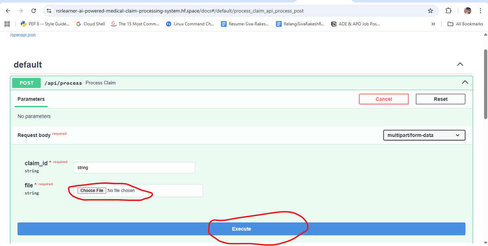
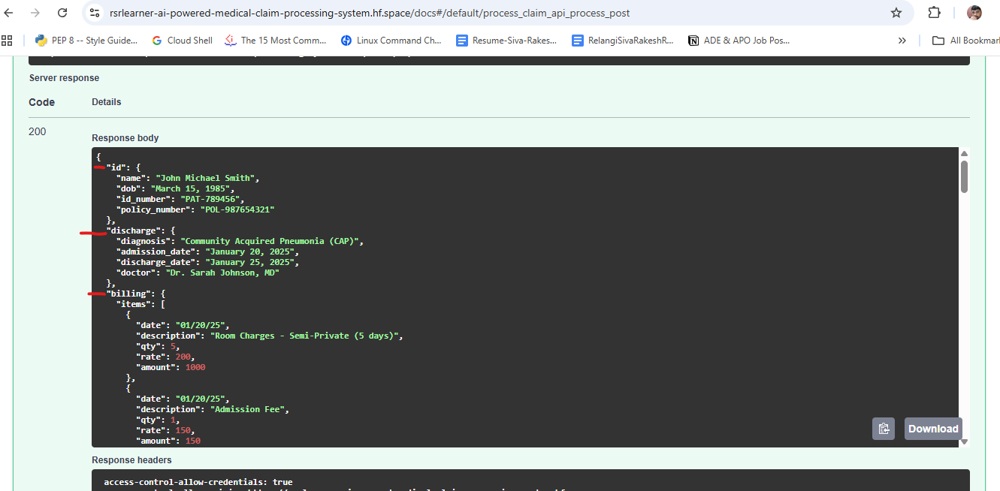

# 🧠 AI-Powered Medical Claim Processing System

An end-to-end intelligent system that processes medical insurance claims from PDFs using OCR, LLMs, and a multi-agent workflow powered by LangGraph.

---
### Deployed ON Hugging Spaces
 
  -  API LINK: https://rsrlearner-ai-powered-medical-claim-processing-system.hf.space/docs#/default/process_claim_api_process_post
## API Using Postman - Screenshots

## API Usage

## 🚀 Overview

This project automates the extraction of structured information from unstructured medical claim documents. It leverages OCR for text extraction and Large Language Models (LLMs) for intelligent classification and data extraction.

---

## 🏗️ Architecture
PDF Upload
↓
OCR (pdf2image + pytesseract)
↓
Segregator Agent (LLM Classification)
↓
┌───────────────┬───────────────┬───────────────┐

↓               ↓               ↓

ID Agent   Discharge Agent    Billing Agent

↓               ↓               ↓

└───────────────┴───────────────┴───────────────┘
↓
Aggregator
↓
Final JSON Output

---

## ⚙️ Key Features

- 📄 PDF Upload via API
- 🔍 OCR-based text extraction (Tesseract)
- 🧠 LLM-based document classification
- 🤖 Multi-agent processing using LangGraph
- ⚡ Parallel execution of extraction agents
- 📦 Structured JSON output
- 🐳 Dockerized deployment (Render / Hugging Face)

---

## 🧠 How It Works

### 1. OCR Layer
- Converts PDF pages into images
- Extracts raw text using Tesseract OCR

### 2. Segregator Agent
- Uses LLM to classify each page into categories:
  - Identity Document
  - Discharge Summary
  - Itemized Bill
  - Others

### 3. Extraction Agents
- **ID Agent** → Extracts patient details  
- **Discharge Agent** → Extracts diagnosis & dates  
- **Billing Agent** → Extracts itemized billing data  

### 4. LangGraph Workflow
- Orchestrates agents
- Executes extraction in parallel
- Aggregates results

---

## 📁 Project Structure
claim-processing/
│
├── app/
│ ├── api/ # FastAPI routes
│ ├── agents/ # LLM-based agents
│ ├── services/ # OCR + LLM services
│ ├── graph/ # LangGraph workflow
│ ├── core/ # Configuration
│
├── Dockerfile
├── requirements.txt
└── README.md

## Create ENV for python and install dependencies
pip install -r requirements.txt

## Set environment variables

Create a .env file:

GROQ_API_KEY=your_api_key_here

## Run the application
python run.py

## Open API Docs
http://localhost:8000/docs
